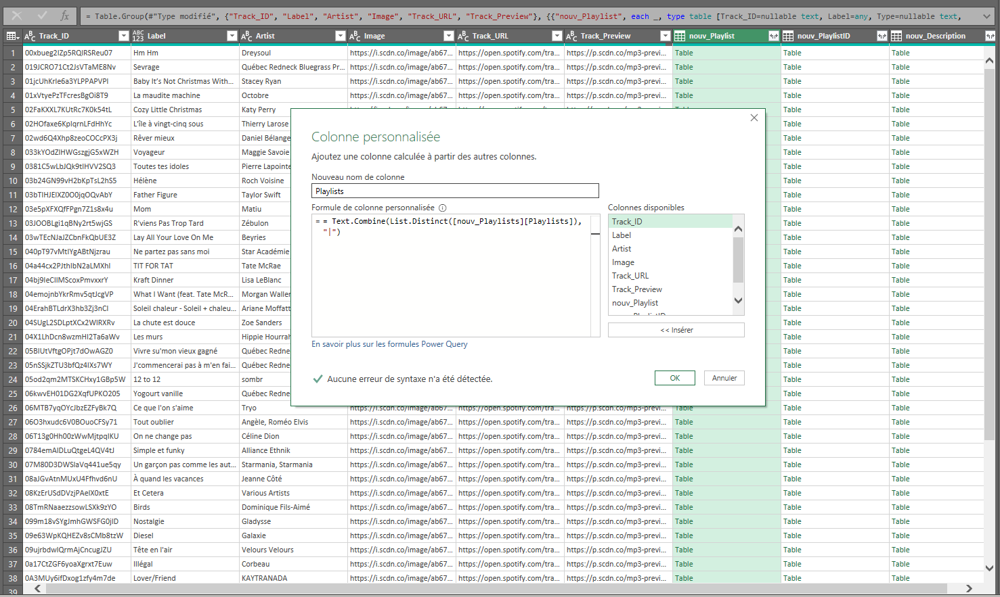
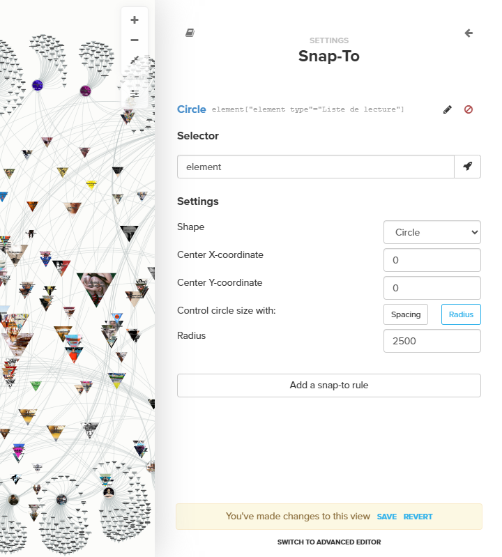

## Sélection des listes de lecture

Les données de la visualisation ont été récoltées à partir de l'[API de Spotify](https://developer.spotify.com/) le 13 novembre 2025, grâce à une requête pour récupérer les listes de lecture de `chansons quebecoises`.
50 listes de lecture ont été extraites de cette façon : nous inférons qu'il s'agit des premiers résultats de recherche.
De celles-ci, nous avons écarté des listes de lecture thématiques ou saisonnières (e.g. de musique de Noël) qui risquaient d'interférer avec les données d'écoute de manière généralisée.
Nous avons également limité notre sélection aux listes de lecture créées par Spotify.

Par la suite, 58 listes de lectures disponibles sur le [profil utilisateur de MusiQC](https://open.spotify.com/user/313awqjv57r24tr4lb6ucxapono4) ont été récupérées.
De celles-ci, une sélection de 25 listes de lecture a été effectuée sur la base de leur pertinence.
Nous avons notamment écarté les titres mettant en valeur la musique francophone non-québécoise (française, belge, suisse...) et sélectionné les listes restantes selon trois critères : 1) programmées par une personnalité du milieu culturel québécois (de type « Untel aime ça ! »); 2) encourageant l'écoute passive de musique, destinées comme adatptées à une activité ou à un contexte en particulier (de type « Apéro romantique »); 3) remplissant une fonction politique ou programmatique propre à la mission de MusiQC (de type « Rentrée scolaire 2025 ! », programmée par le ministre de l'Éducation Bernard Drainville).

## Visualisation

Pour créer une carte de toutes les chansons figurant dans 25 listes de lecture uniques, nous avons utilisé [Kumu](https://kumu.io/).
Il s'agit d'une plateforme de visualisation qui permet de comprendre les relations entre des éléments.
Nous avons utilisé [ce tutoriel](https://blog.kumu.io/endless-data-possibilities-utilizing-apis-for-data-import-into-kumu-869c9e328728) pour créer nos cartes.

### Extraire les données

> Outils utilisés : Google Sheets; API Connector; abonnement Spotify Premium

#### Configurer un connecteur API

Nous avons utilisé [API Connector](https://workspace.google.com/marketplace/app/api_connector/95804724197), un plugiciel (_plug-in_) pour Google Sheets.
Il était assez facile à utiliser et nous a permis d'extraire des données de Spotify.
Une fois installée à partir de la page du _plug-in_, l'API est disponible dans l'onglet Extensions dans Google Sheets. 

À partir de l’onglet « Requests », sélectionnez le bouton « Create request ».  

Si vous utilisez le connecteur pour la première fois, vous devrez ajouter une nouvelle connexion OAuth (à Spotify dans notre cas).

Sous « Add new OAuth », recherchez Spotify, puis cliquez sur « Connect ». 

Sélectionnez « Create new request » pour créer votre première requête. 

#### Créer la requête

Nous nous sommes référés à la [documentation de Spotify](https://developer.spotify.com/documentation/web-api) pour créer une requête.
Il existe plusieurs façons de procéder.

D’abord, nous étions intéressés par un genre spécifique reconnu par Spotify : « Chanson Quebecois » [_sic_]. Nous nous sommes référé·es à [cette liste](https://gist.github.com/andytlr/4104c667a62d8145aa3a), partagée _via_ GitHub Gist, pour trouver le genre qui nous intéressait et confirmer son orthographe.

La requête que nous avons utilisée pour récupérer la liste des playlists est la suivante : 

`https://api.spotify.com/v1/search?q=chansons%2520quebecois&type=playlist&market=CA&limit=50`

Nous souhaitions également extraire les listes de lecture créées par un utilisateur spécifique, MusiQC. L'identifiant utilisateur a été trouvé sur le site Web de Spotify en accédant directement au profil de l'utilisateur et en récupérant le code alphanumérique dans l'URL. 

La requête que nous avons utilisée pour récupérer la liste des playlists est la suivante : 

`https://api.spotify.com/v1/users/313awqjv57r24tr4lb6ucxapono4/playlists`

#### Extraire des listes de lecture depuis Spotify

À ce stade, nous travaillions dans un document Google Sheets et nous avions le panneau API Connector ouvert sur le côté droit.

Nous avons collé la requête que nous avons créée dans la case « Request URL » (URL de requête). 

Nous avons sélectionné Spotify dans la section OAuth. Vous devriez déjà être inscrit avec votre identifiant Spotify. 

Sélectionnez la cellule et indiquez la feuille dans laquelle vous souhaitez que les données soient exportées sous « Output Settings » (Paramètres de sortie), puis exécutez la requête ! Les résultats devraient ressembler à ceci :

#### Extraire des chansons des listes de lecture

Maintenant que nous avions une liste de playlists, nous disposions de leurs identifiants uniques. L'API Spotify permet d'utiliser cet identifiant de playlist pour obtenir ensuite une liste des chansons contenus dans chaque playlist.  

**Identifiants de la liste de lecture** : `playlists.items.id`

**Nom de la liste de lecture** : `playlists.items.name` 

**Propriétaire de la liste de lecture** : `playlists.items.owner.display_name` 

**Description de la liste de lecture** : `playlists.items.description` 

La requête pour extraire des chansons individuelles se présente comme suit et doit être créée manuellement : 

`https://api.spotify.com/v1/playlists/`PLAYLIST_ID_ICI`/tracks`

Nous étions uniquement intéressé·es par les playlists créées par Spotify. Nous avons isolé les identifiants des playlists qui nous intéressaient et les avons collés dans une nouvelle feuille afin de créer de manière programmatique nos requêtes pour chaque playlist. 

Nous avons ensuite utilisé la fonction `=TEXTJOIN` pour créer une colonne contenant l'URL de requête pour chaque liste de lecture.

Nous avons pu coller plusieurs requêtes à la fois dans le connecteur API dans la section « URL de requête ». 

Dans « Output Options », nous avons coché les options « Add timestamp », « Add request URL » et « Add request body ». Cela nous a permis de différencier facilement les chansons associées à chaque liste de lecture.

### Mise en forme des données

> Outils utilisés : Google Sheets; Microsoft Excel; PowerQuery

Il était maintenant temps de structurer les données pour les importer dans Kumu. Nous avons réorganisé toutes les données au format standard de Kumu, en veillant à ce qu'il y ait une colonne intitulée « Labels » (noms des playlists ou des chansons) et « Type » (playlists et chansons).  

#### Récupérer toutes les données importantes

> Cette étape nécessite beaucoup de copier-coller !

Les données générées par la requête API sont assez volumineuses, il est donc utile de les formater afin de regrouper toutes les informations importantes au même endroit. Cette étape est facultative, mais utile. 

Nous avons conçu [un tableau](https://docs.google.com/spreadsheets/d/1hhtWQHIedv5RP2Ecbb2TonboKkl_GeuPyd3eUbfIx7M/edit?usp=sharing) qui peut être copié et est utile pour regrouper clairement les données issues des deux tableaux, (1) des listes de lecture et (2) des chansons.

#### Formatter les données pour Kumu

##### Création des deux feuilles distinctes

Afin de faciliter l'importation optimale de nos données dans Kumu, les informations ont été formatées en deux feuilles distinctes au sein d'un même tableur. Une feuille est dédiée à toutes les informations concernant les playlists, tandis qu'une seconde feuille a été consacrée à toutes les informations concernant les chansons. Il est important que les noms et les identifiants des playlists correspondent. Pour mener à bien cette étape, nous nous sommes fié·es à [la documentation fournie par Kumu concernant l'importation des données](https://docs.kumu.io/guides/import/import).

Le [tableau suivant](https://docs.google.com/spreadsheets/d/1ffBRiC8DPqxO7aKOz6PggDHGOQniJYmnlGHhiqCnyKg/edit?usp=sharing) peut être copié et utilisé pour mettre en forme vos propres données. Il contient un exemple de nos données mises en forme .

##### Création d'une colonne pour les artistes

Si une chanson comporte plusieurs artistes, ces informations seront réparties sur plusieurs colonnes. Nous avons utilisé la fonction `=TEXTJOIN` pour regrouper ces informations dans une seule colonne.

#### Formatter dans PowerQuery (dans Excel) 

La partie suivante est très importante si vous souhaitez visualiser le nombre de chansons présentes dans plusieurs listes de lecture. Dans sa forme actuelle, les chansons qui apparaissent plusieurs fois dans l'ensemble de données auront le même identifiant et le même nom, mais seront associées à des identifiants et des noms de playlists différents. 

Ce qu'il faut faire à cette étape, c'est dédupliquer ces entrées de chansons et séparer les informations de playlist multiples à l'aide d'une barre verticale `|`. 

Ainsi, une chanson qui figure dans plusieurs playlists apparaîtra comme suit dans l'ensemble de données :

##### Préparer le tableau

Nous avons commencé par télécharger notre feuille Google Sheet sous forme de document `.xlsx` et l'avons ouverte dans Excel. 

Dans Excel, nous avons créé un tableau contenant nos données sur les chansons, suivant le chemin suivant dans les menus : Accueil > Insérer > Tableau. Confirmez la plage et vérifiez que l'option « Ma table comporte des en-têtes » est cochée, puis cliquez sur OK. La sélection prend désormais la forme d'un tableau Excel, ce qui facilite son chargement dans PowerQuery. 

##### Charger dans PowerQuery

Accédez à l'onglet Données > À partir d'un tableau/plage.
La fenêtre Power Query Editor s'ouvre avec notre tableau et affiche nos colonnes (`Track_ID`, `Label`, etc.) 

Nous avons ensuite choisi comment définir les doublons. Cela signifie quelles colonnes identifient de manière unique une chanson. Nous avons sélectionné `Track_ID`, `Label` (nom de la chanson), `Artiste`, `Image`, `Track_URL` et `Track_Preview`. Pour sélectionner plusieurs colonnes en même temps, appuyez sur CTRL/CMD au moment de sélectionner les items. Nous avons ensuite sélectionné « Regrouper par ». 

##### Agréger les données dans PowerQuery

Dans la boîte de dialogue « Regrouper par » qui s'affiche, configurez ensuite les informations qui doivent être agrégées.

Dans notre cas, nous devions agréger les noms des listes de lecture (`Playlist`), les identifiants des listes de lecture (`Playlist_ID`) et la description des listes de lecture (`Description`). Sous l’option « Nouveau nom de colonne », nous avons choisi : `nouv_Playlists`. Pour l'option « Opération », nous avons choisi « Toutes les lignes », car cela créera une liste que nous pourrons transformer plus tard.

Cliquez sur « OK » pour créer le tableau groupé. Cette étape a ensuite été répétée pour chaque nouvelle colonne.

#### Combiner les informations dans PowerQuery

Nous voulions maintenant demander à PowerQuery de combiner tous les noms de listes de lecture de chaque groupe en une seule valeur texte. Dans le tableau, nous avons localisé la colonne `nouv_Playlist` créée par « Regrouper par », nous l'avons sélectionnée, puis avons créé une nouvelle colonne à partir de la fonction Ajouter une colonne > Colonne personnalisée.

Nous avons répété cette étape pour les deux autres colonnes qui devaient être agrégées (`Playlist_ID` et `Description`). Une fois ces étapes terminées, nous avons sélectionné « Fermer et charger ». 

## Créer la visualisation dans Kumu

> Outil utilisé : Kumu

### Importer les données

Dans une nouvelle carte Kumu, nous avons importé la feuille de calcul. Nous avons testé l'importation d'une feuille Google Sheet et d'un formulaire `.xlsx`. Des erreurs peuvent survenir lors de l'importation. Nous avons dû supprimer les lignes supplémentaires et nettoyer les cellules vides pour résoudre les messages d'erreur. Nous avons finalement opté pour l'importation d'un formulaire `.xlsx`, car les éléments de la carte bougeaient lorsque nous importions une feuille Google Sheet. Si vous décidez d'importer une feuille Google Sheet, Kumu fournit [de la documentation à cet effet](https://docs.kumu.io/guides/import/google-sheets).

### Créer les liens

Une fois les données importées, nous avons dû établir le lien entre les listes de lecture et les chansons. Nous avons utilisé la fonctionnalité « Connect by » de Kumu pour sélectionner le champ « Playlist ». Kumu trouve ainsi les éléments qui sont des listes de lecture et les connecte automatiquement aux éléments qui sont des chansons.

### Classer les chansons par popularité

Nous voulions que les chansons soient classées par degré, c'est-à-dire que plus le degré est élevé, plus la chanson apparaît dans un grand nombre de listes de lecture. Pour ce faire, nous avons sélectionné l'icône en forme de bécher en bas de l'écran, qui permet d'explorer [la fonction « Metrics » de Kumu](https://docs.kumu.io/guides/metrics).

Nous avons ensuite suivi ce chemin dans les menus : Metrics > Social Network Analysis > Choose a metric > Degree > Discover the connectors/Hubs

### Décorer les éléments

À des fins esthétiques, nous avons utilisé [les fonctions « Decoration » de Kumu](https://docs.kumu.io/guides/decorate), et avons choisi de représenter les listes de lecture sous forme de cercles et les morceaux sous forme de triangles, puis nous avons mis les les morceaux à l'échelle en fonction de leur degré.

### Mettre les éléments en place

Afin de conserver les éléments en place, nous avons utilisé [la fonction « Snap to » de Kumu](https://docs.kumu.io/guides/layouts/snap-to).

### Ajouter des informations aux éléments

À l'aide de [la fonction « Popovers » de Kumu](https://docs.kumu.io/guides/decorate/popovers), nous avons ajouté des informations contextuelles afin que tout le monde puisse survoler une playlist ou une chanson et voir son nom et ses informations de base. 

### Créer des filtres pour les éléments

Nous avons ajouté des commandes en haut de la page afin que tout le monde puisse [filtrer les données](https://docs.kumu.io/guides/controls/filter-control) pour ne voir que les chansons qui apparaissent dans plusieurs listes de lecture. 

Nous avons ensuite utilisé le sélecteur dans la barre de recherche (icône en forme de fusée à droite après avoir cliqué sur la barre de recherche) pour sélectionner uniquement les listes de lecture, puis nous avons utilisé la fonction d'alignement pour placer ces listes de lecture dans un cercle. 
